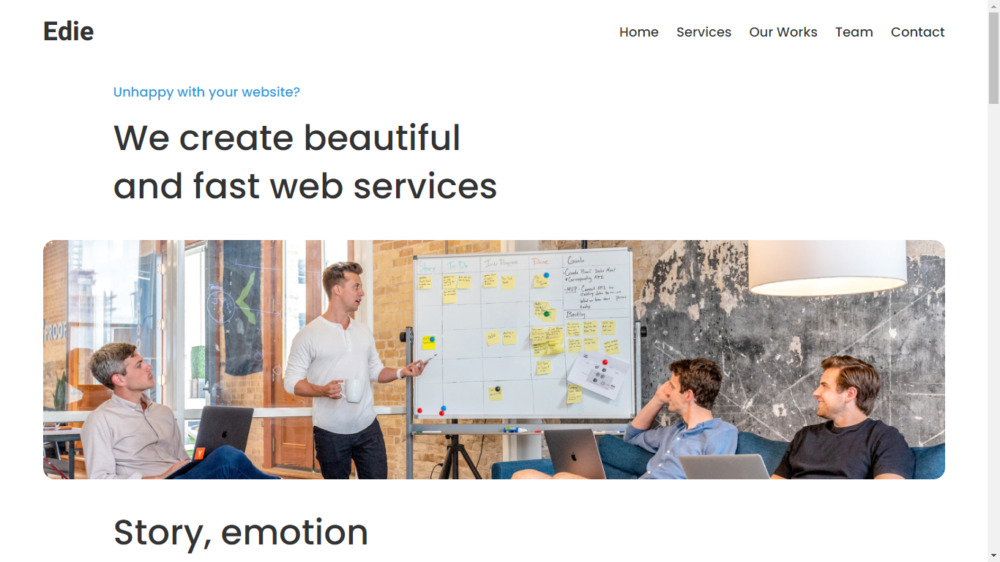
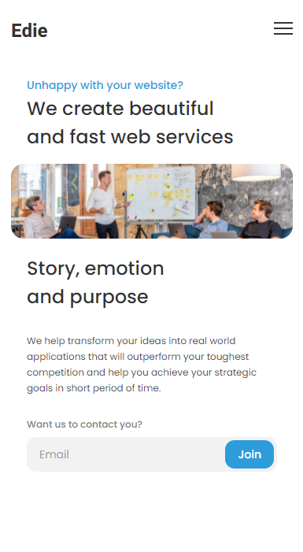
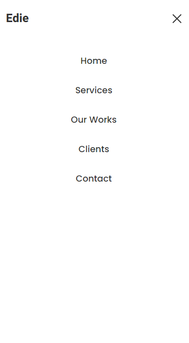

<h1 align="center">Interior Consultant Landing (UI)</h1>

   Solution for <a href="https://devchallenges.io/challenges/xobQBuf8zWWmiYMIAZe0" target="_blank">the challenge</a>.

  <h3>
    <a href="https://edie-aoa97.netlify.app/">
      Demo
    </a>
     | 
    <a href="https://devchallenges.io/solutions/zrhUvx68HVBh6s62QoY2">
      Solution
    </a>
     | 
    <a href="https://devchallenges.io/challenges/xobQBuf8zWWmiYMIAZe0">
      Challenge
    </a>
  </h3>

<!-- TABLE OF CONTENTS -->

## Table of Contents

- [Overview](#overview)
  - [Built With](#built-with)
- [Features](#features)
- [Contact](#contact)

<!-- OVERVIEW -->

## Overview

### Built With
- HTML
- CSS
- TailwindCSS
- VanillaJS

## Contact

- GitHub [@aoa97](https://github.com/aoa97)
- LinkedIn [@aoa97](https://www.linkedin.com/in/engahmedusama/)
